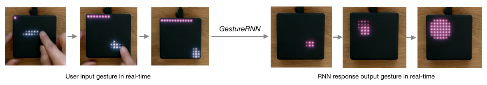
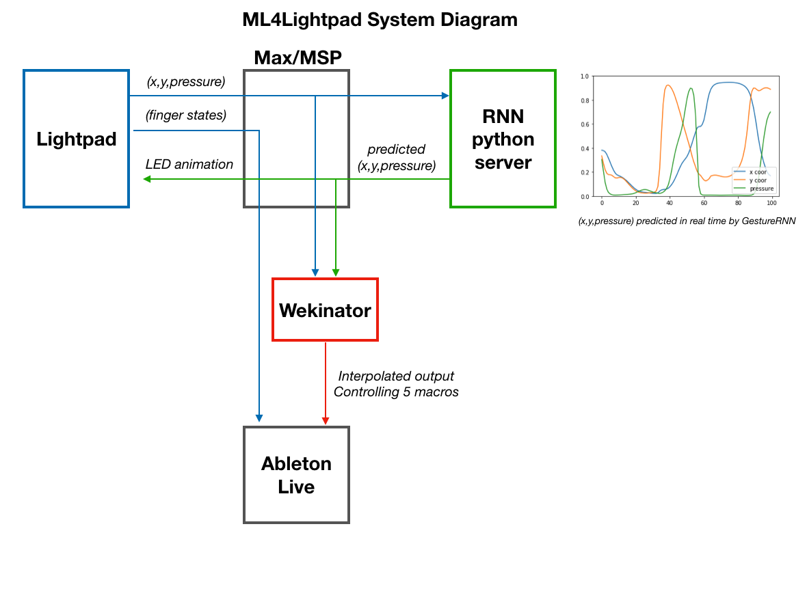

# GestureRNN-ML4Lightpad
Using LSTM's to learn a musician's musical gestures on the Roli Lightpad and collaboratively generate new movements

# Checkout the Demo video!
This was originally my final project from Prof. Jason Freeman's "MUSI6002: Interactive Music" class at the Georgia Tech Center for Music Technology. 

## *ML4Lightpad* introduction
We use machine learning and deep learning to create a new kind of musical instrument based on the new Roli Lightpad instrument. Firstly, we use Wekinator's machine learning capabilities to continuously interpolate between various sonic parameters in a custom-designed *tension* synthesizer in Ableton Live. More importantly, we train a three-layer LSTM that learns to generate gestures and swipes across the surface of the Lightpad based on user input called *GestureRNN*. GestureRNN regresses continuous values of (x,y) coordinates and instantaneous pressure (p) in real-time based on a user's seed gesture. 

### Rationale

This project explores the notion of using *low dimensional* outputs to create art. Machine learning models used for generative art tend to model and render the final *high dimensional* output directly. For example, LSTM's trained on MIDI output the final piano roll directly (88x16 ~ 1400 dimensions), GANs generate the final image directly (64x64x3 ~ 12000 dimensions) while WaveNet generates the final waveform directly (22000x256 ~ 5,000,000 dimensions per second). 

We argue that humans do not operate in this final high dimensional output. An artist does not think about the final RGB values of each pixel, but instead thinks in terms of brushstrokes and movements across the canvas. A musician does not think of the final score, but instead chooses notes based on embodied and cognitive process that synthesizes the current music, timbre of surroudning instruments and physical constraints of both the player and instrument. *GestureRNN* for Lightpad thus does not generate the final waveform directly, but listens and learns the musical gestures from an experienced player that produce expressive motifs on the instrument. 

The work was heavily inspired by David Ha's *SketchRNN*, a deep learning model trained on human sketches, and conversations with Doug Eck, both from the Google Magenta team. *SketchRNN* is able to learn pen strokes from over 50,000 sketches and "draw" in real time with the user. This situation translates beautifully into GestureRNN for the Lightpad.

## Usage Instructions

### Collecting the various components

A high level system diagram of ML4Lightpad system consisting of the Lightpad, MaxMSP, Python and Ableton Live is shown below.

There are many **many** moving parts in this project. I will attempt to explain each component so that you can still use parts of this project.

#### Roli Lightpad
This is a pressure sensitive multi-touch instrument developed by Roli (best known for their futuristic seaboard). I am using the 1st Gen Lightpad; the company just released a 2nd Gen Lightpad M. 

#### MaxMSP
MaxMSP is the brain of the project. The patch is named `ML4Lightpad.patch` in the repo. You will need to download the specialized `blocks` object from the Max Package Manager

#### GestureRNN server
`GestureRNN_server.py` contains the code that receives messages containing (x,y,p) through udp port `8000` from MaxMSP and sends back predictions through udp port `8001` back to Max/MSP. The server also contains a finite state machine to change from `listening` and `predicting` states. 

#### Models and python environment

If you want to train your own model, look at the python notebook `GestureRNN_train.ipynb` to see how I loaded data in from MaxMSP and defined/trained the LSTM model. Assuming you are using conda you can run commands:

`conda create --name gesture-rnn python=3.5`
`source activate gesture-rnn`
`pip install -r requirements.txt`
then
`jupyter notebook` to launch a notebook session or
`python GestureRNN_server.py` to launch the server.

Pretrained models with various "lookback" lengths (the number of previous samples used to predict future samples) are available in directory `./models`. The weights are trained on my (Lamtharn Hantrakul) playing style.

#### Wekinator
Wekinator is an awesome machine learning tool by Rebecca Fiebrink. Download it on this link and then use the open file menu to open the `WekinatorProject.wekproj` located in `./GestureRNN_Wekinator`

#### Ableton Live
My DAW of choice for live electronic music performance. The project file is available in the directory `Ableton Project`. I don't use any samples, the synthesis engine is based on the `tension` physical modelling instrument and various effects mapped to macro knobs. 
